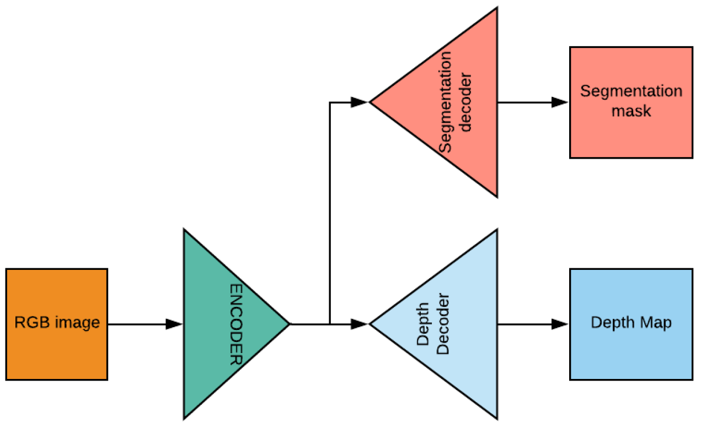
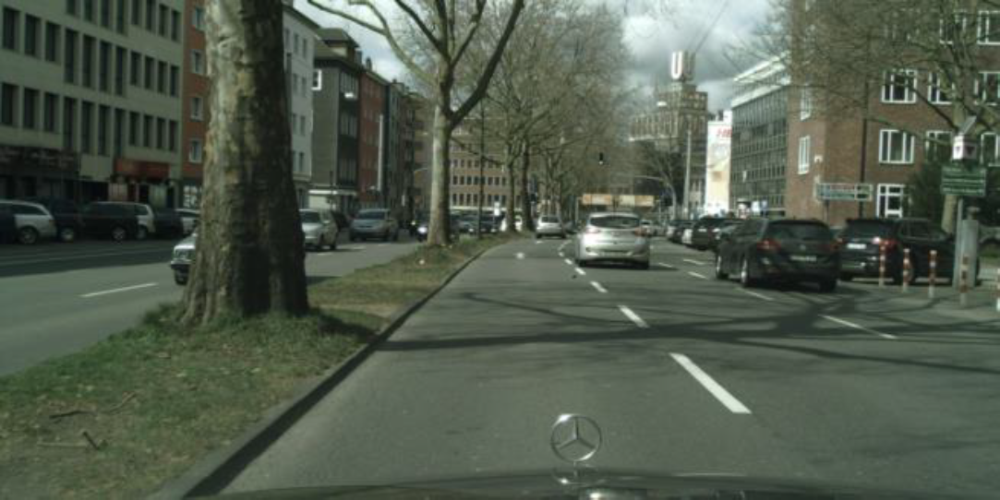
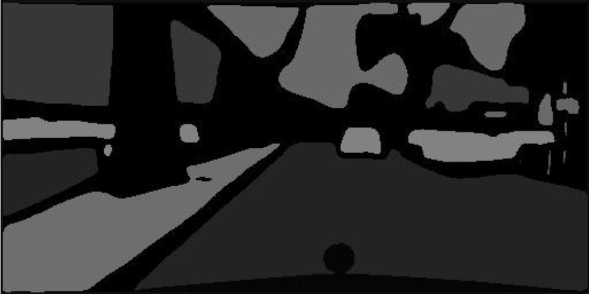
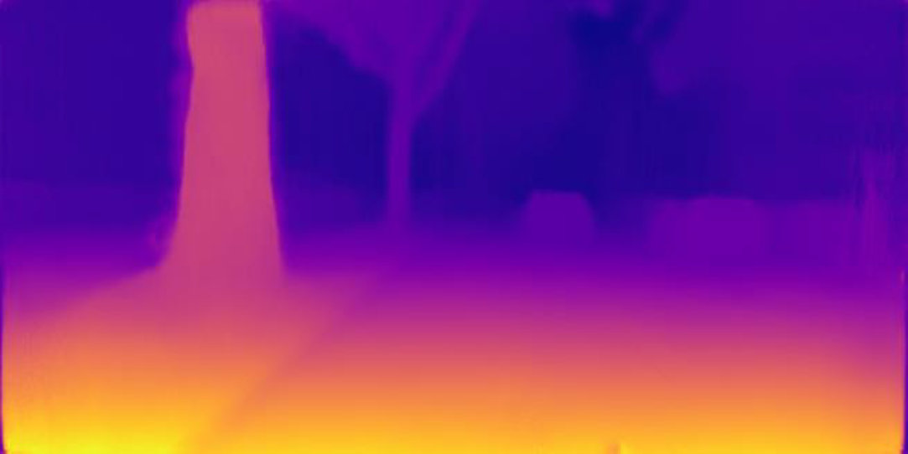

# Introduction
Our project focuses on depth estimation and semantic segmentation, two of the most important tasks in computer vision. Both tasks are typically addressed separately, but we have considered integrating them into the same framework because they may benefit each other in terms of improving accuracy. Both the depth estimation and semantic segmentation networks have been combined into a single convolutional network. The main goal is to maintain the best features of both networks while improving results without sacrificing accuracy. Our methodology outperforms the state of the art on single-task approaches while achieving competitive results when compared to other multi-task methods, according to qualitative and quantitative experiments.

## Architecture

## Dataset
NYUdv2 dataset was used for training.

## Original Image

## Segmentation Mask

## Depth Map

## References
SegNet: http://mi.eng.cam.ac.uk/projects/segnet/tutorial.html
Unsupervised Monocular Depth Estimation with Left-Right Consistency: https://arxiv.org/pdf/1609.03677.pdf
https://github.com/mrharicot/monodepth
https://github.com/hari-sikchi/DepthSegnet

